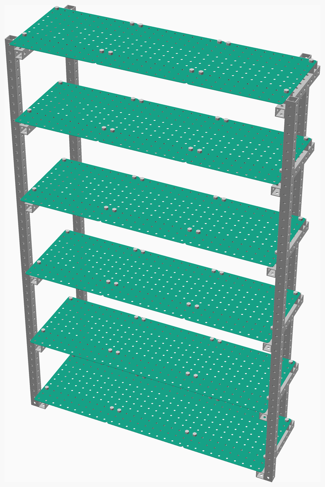
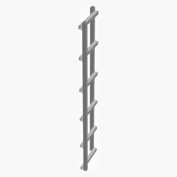
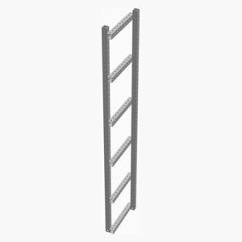
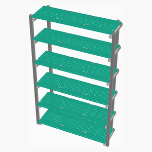

# Bookshelves

---
## Table of Contents
1. [Parts list](#Parts_list)
1. [Shelf Assembly](#shelf_assembly)
1. [Right Side Assembly](#right_side_assembly)
1. [Left Side Assembly](#left_side_assembly)
1. [Main Assembly](#main_assembly)

[Top](#TOP)

---

## Parts list
| 6 x Shelf | Right&nbsp;Side | Left&nbsp;Side | Main | TOTALS |  |
|---:|---:|---:|---:|---:|:---|
|  |  |  |  | | **Vitamins** |
| &nbsp;&nbsp;12&nbsp; | &nbsp;&nbsp;.&nbsp; | &nbsp;&nbsp;.&nbsp; | &nbsp;&nbsp;.&nbsp; |  &nbsp;&nbsp;12&nbsp; | &nbsp;&nbsp; Aluminium rectangular box section 40mm x 40mm x 3mm, length 1200mm |
| &nbsp;&nbsp;.&nbsp; | &nbsp;&nbsp;2&nbsp; | &nbsp;&nbsp;2&nbsp; | &nbsp;&nbsp;.&nbsp; |  &nbsp;&nbsp;4&nbsp; | &nbsp;&nbsp; Aluminium rectangular box section 40mm x 40mm x 3mm, length 2000mm |
| &nbsp;&nbsp;.&nbsp; | &nbsp;&nbsp;6&nbsp; | &nbsp;&nbsp;6&nbsp; | &nbsp;&nbsp;.&nbsp; |  &nbsp;&nbsp;12&nbsp; | &nbsp;&nbsp; Aluminium rectangular box section 40mm x 40mm x 3mm, length 400mm |
| &nbsp;&nbsp;72&nbsp; | &nbsp;&nbsp;.&nbsp; | &nbsp;&nbsp;.&nbsp; | &nbsp;&nbsp;.&nbsp; |  &nbsp;&nbsp;72&nbsp; | &nbsp;&nbsp; Nut M12 x 12mm nyloc |
| &nbsp;&nbsp;72&nbsp; | &nbsp;&nbsp;.&nbsp; | &nbsp;&nbsp;.&nbsp; | &nbsp;&nbsp;.&nbsp; |  &nbsp;&nbsp;72&nbsp; | &nbsp;&nbsp; Screw M12 hex x 52mm |
| &nbsp;&nbsp;156&nbsp; | &nbsp;&nbsp;8&nbsp; | &nbsp;&nbsp;8&nbsp; | &nbsp;&nbsp;.&nbsp; | &nbsp;&nbsp;172&nbsp; | &nbsp;&nbsp;Total vitamins count |

[Top](#TOP)

---

## 6 x Shelf Assembly
### Vitamins
|Qty|Description|
|---:|:----------|
|12| Aluminium rectangular box section 40mm x 40mm x 3mm, length 1200mm|
|72| Nut M12 x 12mm nyloc|
|72| Screw M12 hex x 52mm|

### Assembly instructions

[Top](#TOP)

---

## Right Side Assembly
### Vitamins
|Qty|Description|
|---:|:----------|
|2| Aluminium rectangular box section 40mm x 40mm x 3mm, length 2000mm|
|6| Aluminium rectangular box section 40mm x 40mm x 3mm, length 400mm|

### Assembly instructions

Right side assembly

[Top](#TOP)

---

## Left Side Assembly
### Vitamins
|Qty|Description|
|---:|:----------|
|2| Aluminium rectangular box section 40mm x 40mm x 3mm, length 2000mm|
|6| Aluminium rectangular box section 40mm x 40mm x 3mm, length 400mm|

### Assembly instructions

Left side assembly

[Top](#TOP)

---

## Main Assembly
### Sub-assemblies

| 1 x left_side_assembly | 1 x right_side_assembly | 6 x shelf_assembly |
|---|---|---|
|  |  |  

### Assembly instructions

[Top](#TOP)
