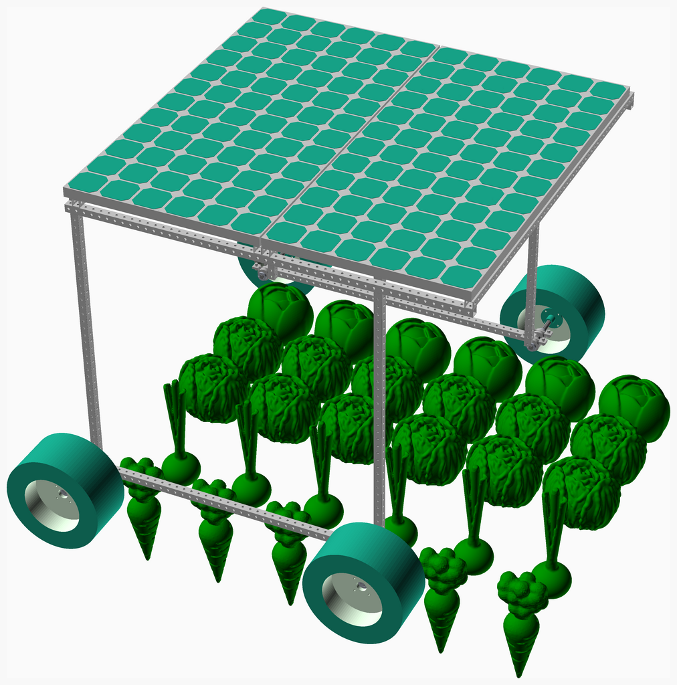
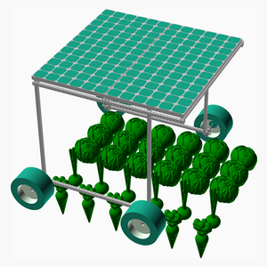

# Assembly-farm-robots

---
## Table of Contents
1. [Parts list](#Parts_list)
1. [Main Assembly](#main_assembly)

[Top](#TOP)

---

## Parts list
| Main | TOTALS |  |
|---:|---:|:---|
|  | | **Vitamins** |
| &nbsp;&nbsp;6&nbsp; |  &nbsp;&nbsp;6&nbsp; | &nbsp;&nbsp; Aluminium rectangular box section 40mm x 40mm x 3mm, length 1600mm |
| &nbsp;&nbsp;6&nbsp; |  &nbsp;&nbsp;6&nbsp; | &nbsp;&nbsp; Aluminium rectangular box section 40mm x 40mm x 3mm, length 2000mm |
| &nbsp;&nbsp;16&nbsp; |  &nbsp;&nbsp;16&nbsp; | &nbsp;&nbsp; Nut M12 x 12mm  |
| &nbsp;&nbsp;16&nbsp; |  &nbsp;&nbsp;16&nbsp; | &nbsp;&nbsp; Screw M12 hex x 30mm |
| &nbsp;&nbsp;8&nbsp; |  &nbsp;&nbsp;8&nbsp; | &nbsp;&nbsp; UCP205_16 pillow block |
| &nbsp;&nbsp;32&nbsp; |  &nbsp;&nbsp;32&nbsp; | &nbsp;&nbsp; Washer  M12 x 22mm x 2mm |
| &nbsp;&nbsp;84&nbsp; | &nbsp;&nbsp;84&nbsp; | &nbsp;&nbsp;Total vitamins count |

[Top](#TOP)

---

## Main Assembly
### Vitamins
|Qty|Description|
|---:|:----------|
|6| Aluminium rectangular box section 40mm x 40mm x 3mm, length 1600mm|
|6| Aluminium rectangular box section 40mm x 40mm x 3mm, length 2000mm|
|16| Nut M12 x 12mm |
|16| Screw M12 hex x 30mm|
|8| UCP205_16 pillow block|
|32| Washer  M12 x 22mm x 2mm|

### Assembly instructions

[Top](#TOP)
