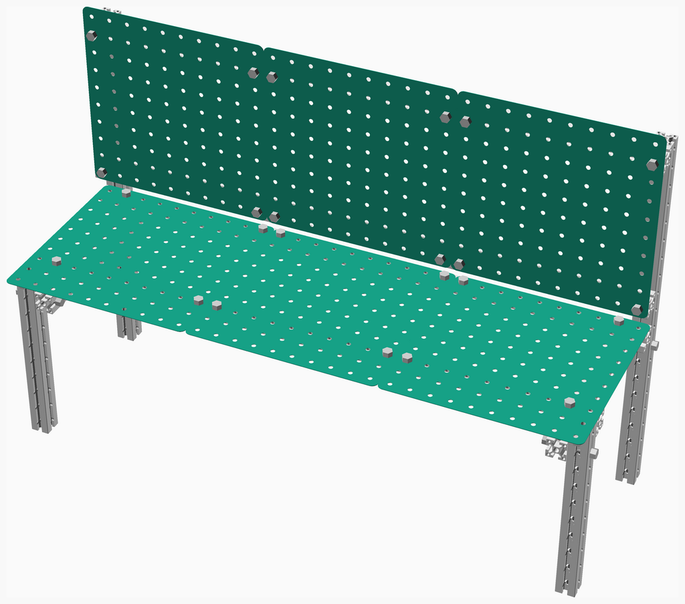
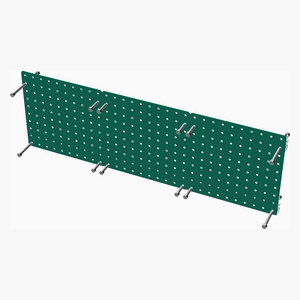
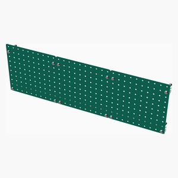
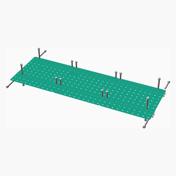
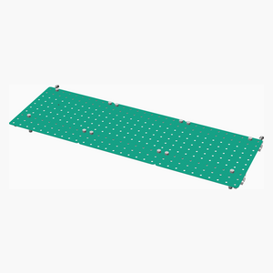
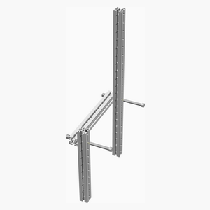
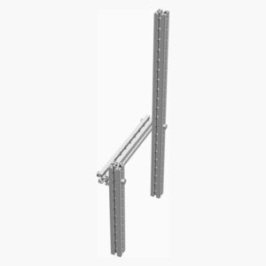
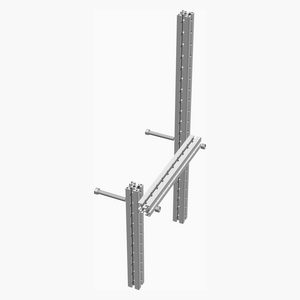
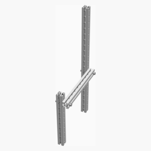
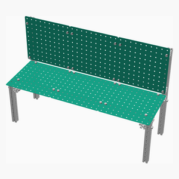

# Bench
Basic bench built with standardized and fully reusable components.

---
## Table of Contents
1. [Parts list](#Parts_list)
1. [Back Assembly](#back_assembly)
1. [Seat Assembly](#seat_assembly)
1. [Left Assembly](#left_assembly)
1. [Right Assembly](#right_assembly)
1. [Main Assembly](#main_assembly)

[Top](#TOP)

---

## Parts list
| Back | Seat | Left | Right | Main | TOTALS |  |
|---:|---:|---:|---:|---:|---:|:---|
|  |  |  |  |  | | **Vitamins** |
| &nbsp;&nbsp;2&nbsp; | &nbsp;&nbsp;2&nbsp; | &nbsp;&nbsp;.&nbsp; | &nbsp;&nbsp;.&nbsp; | &nbsp;&nbsp;.&nbsp; |  &nbsp;&nbsp;4&nbsp; | &nbsp;&nbsp; Extrusion E4040 x 1200mm |
| &nbsp;&nbsp;.&nbsp; | &nbsp;&nbsp;.&nbsp; | &nbsp;&nbsp;2&nbsp; | &nbsp;&nbsp;2&nbsp; | &nbsp;&nbsp;.&nbsp; |  &nbsp;&nbsp;4&nbsp; | &nbsp;&nbsp; Extrusion E4040 x 400mm |
| &nbsp;&nbsp;.&nbsp; | &nbsp;&nbsp;.&nbsp; | &nbsp;&nbsp;1&nbsp; | &nbsp;&nbsp;1&nbsp; | &nbsp;&nbsp;.&nbsp; |  &nbsp;&nbsp;2&nbsp; | &nbsp;&nbsp; Extrusion E4040 x 800mm |
| &nbsp;&nbsp;12&nbsp; | &nbsp;&nbsp;16&nbsp; | &nbsp;&nbsp;2&nbsp; | &nbsp;&nbsp;2&nbsp; | &nbsp;&nbsp;.&nbsp; |  &nbsp;&nbsp;32&nbsp; | &nbsp;&nbsp; Nut M12 x 12mm nyloc |
| &nbsp;&nbsp;8&nbsp; | &nbsp;&nbsp;8&nbsp; | &nbsp;&nbsp;.&nbsp; | &nbsp;&nbsp;.&nbsp; | &nbsp;&nbsp;.&nbsp; |  &nbsp;&nbsp;16&nbsp; | &nbsp;&nbsp; Screw M12 hex x 52mm |
| &nbsp;&nbsp;4&nbsp; | &nbsp;&nbsp;8&nbsp; | &nbsp;&nbsp;2&nbsp; | &nbsp;&nbsp;2&nbsp; | &nbsp;&nbsp;.&nbsp; |  &nbsp;&nbsp;16&nbsp; | &nbsp;&nbsp; Screw M12 hex x 92mm |
| &nbsp;&nbsp;26&nbsp; | &nbsp;&nbsp;34&nbsp; | &nbsp;&nbsp;7&nbsp; | &nbsp;&nbsp;7&nbsp; | &nbsp;&nbsp;.&nbsp; | &nbsp;&nbsp;74&nbsp; | &nbsp;&nbsp;Total vitamins count |

[Top](#TOP)

---

## Back Assembly
### Vitamins
|Qty|Description|
|---:|:----------|
|2| Extrusion E4040 x 1200mm|
|12| Nut M12 x 12mm nyloc|
|8| Screw M12 hex x 52mm|
|4| Screw M12 hex x 92mm|

### Assembly instructions

Attach backrests to support rails

[Top](#TOP)

---

## Seat Assembly
### Vitamins
|Qty|Description|
|---:|:----------|
|2| Extrusion E4040 x 1200mm|
|16| Nut M12 x 12mm nyloc|
|8| Screw M12 hex x 52mm|
|8| Screw M12 hex x 92mm|

### Assembly instructions

Attach seats to support rails

[Top](#TOP)

---

## Left Assembly
### Vitamins
|Qty|Description|
|---:|:----------|
|2| Extrusion E4040 x 400mm|
|1| Extrusion E4040 x 800mm|
|2| Nut M12 x 12mm nyloc|
|2| Screw M12 hex x 92mm|

### Assembly instructions

Assemble left legs and rear upright

[Top](#TOP)

---

## Right Assembly
### Vitamins
|Qty|Description|
|---:|:----------|
|2| Extrusion E4040 x 400mm|
|1| Extrusion E4040 x 800mm|
|2| Nut M12 x 12mm nyloc|
|2| Screw M12 hex x 92mm|

### Assembly instructions

Assemble right legs and rear upright

[Top](#TOP)

---

## Main Assembly
### Sub-assemblies

| 1 x back_assembly | 1 x left_assembly | 1 x right_assembly |
|---|---|---|
|  |  |  

| 1 x seat_assembly |
|---|
|  

### Assembly instructions

Attach seat and back assemblies to side assembles with bolts

[Top](#TOP)
